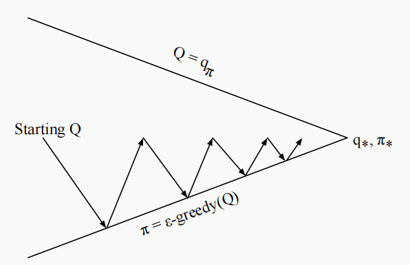
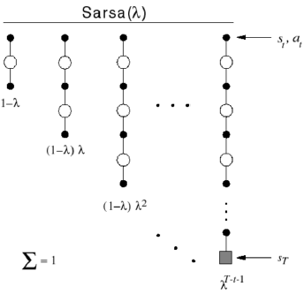

# SimpleRL

Simplerl is an educational reinforcement learning library implementing fundamental algorithms like Monte Carlo (MC), Temporal Difference (TD), SARSA, and Q-Learning. It provides clean, beginner-friendly Python implementations alongside classic environments such as GridWorld, CliffWalking, and FrozenLake. Designed for RL learners and researchers, Simplerl offers a practical starting point for understanding core reinforcement learning concepts through hands-on experimentation with essential algorithms and standardized testing scenarios.

## Sarsa

Q-function Bellman Expectation Equation:

$$Q\_\pi(s,a)=\mathcal{R}\_s^a+\gamma\sum\_{s^{\prime}\in\mathcal{S}}\mathcal{P}\_{ss^{\prime}}^a\sum\_{a^{\prime}\in\mathcal{A}}\pi(a^{\prime}|s^{\prime})Q\_\pi(s^{\prime},a^{\prime})$$

Using Samples to Represent Reward $R$ and Model $P$ Function. In online learning, the agent observes a trajectory $(s, a, r, s', a')$ at each timestep.

TD Learning Q-function:

$$Q(s,a) \leftarrow Q(s,a) + \alpha \left( r + \gamma Q\left(s', a'\right) - Q(s, a) \right)$$

Sarsa Control at each time step: 

- Policy Evaluation: Temporal Difference (TD)Learning: $Q \approx Q\_{\pi}$
- Policy Improvement: ε-Greedy Strategy

## n-step Sarsa

**n-step Sarsa** is a generalization of the one-step Sarsa algorithm. It updates the action-value function $Q(s, a)$ based on the *n-step Q-return*, which incorporates rewards from multiple future steps. This approach provides a compromise between the fast updates of one-step methods and the potentially more accurate updates of Monte Carlo methods.

### Definition of n-step Q-return

The n-step Q-return at time $t$ is defined as:

$$q\_t^{(n)} = r\_{t+1} + \gamma r\_{t+2} + \cdots + \gamma^{n-1} r\_{t+n} + \gamma^n Q(s\_{t+n}, a\_{t+n})$$

This return combines the actual rewards received over the next $n$ steps with a bootstrapped estimate of the value of the state-action pair at step $t + n$.

### n-step Sarsa Update Rule

The action-value function is updated toward the n-step Q-return as follows:

$$Q(s\_t, a\_t) \leftarrow Q(s\_t, a\_t) + \alpha \left( q\_t^{(n)} - Q(s\_t, a\_t) \right)$$

This update rule gradually adjusts $Q(s\_t, a\_t)$ in the direction of the estimated return $q\_t^{(n)}$, with learning rate $\alpha$.

## Sarsa(λ)

Sarsa(λ) is an extension of the Sarsa algorithm that incorporates eligibility traces to combine the benefits of multi-step returns. This enhancement helps to more efficiently address the credit assignment problem in temporal-difference (TD) learning by accelerating the propagation of reward signals through the state-action space.

Eligibility traces serve as a temporary memory, recording the visitation history of state-action pairs, which allows the algorithm to assign credit to multiple prior steps, not just the most recent one.

### Forward Sarsa(λ)

The **forward Sarsa(λ)** algorithm computes the λ-return by taking a weighted sum of all *n-step returns*.

#### λ-Return Formula

Let $q\_t^{(n)}$ denote the *n-step Q-return* at time $t$. The λ-return $q\_t^{\lambda}$ is defined as a geometric mixture of these n-step returns, weighted by $(1 - \lambda) \lambda^{n - 1}$:

- For infinite-length trajectories:
$$q\_t^{\lambda} = (1 - \lambda) \sum\_{n=1}^{\infty} \lambda^{n-1} q\_t^{(n)}$$
- For finite trajectories ending at time $T$:
$$q\_t^{\lambda} = (1 - \lambda) \sum\_{n=1}^{T-t-1} \lambda^{n-1} q\_t^{(n)} + \lambda^{T - t - 1} q\_t$$

Update Rule
Once the λ-return is computed, the Q-value update is given by:

$$Q(s\_t, a\_t) \leftarrow Q(s\_t, a\_t) + \alpha (q\_t^{\lambda} - Q(s\_t, a\_t))$$

Forward Sarsa(λ) offers better predictions of future rewards by leveraging multi-step information, weighted through the parameter $\lambda$. However, since it requires full trajectories to calculate returns, it is typically used in **offline** or **batch learning** settings.

### Backward Sarsa(λ)

**Backward Sarsa(λ)** utilizes eligibility traces to perform **online learning**, updating Q-values incrementally at each time step. Instead of explicitly computing multi-step returns, it implicitly approximates them through eligibility traces.

Eligibility Trace Definition
At each time step, for every state-action pair $(s, a)$, an eligibility trace $E\_t(s, a)$ is maintained:

- Initialization:
$$E\_0(s, a) = 0$$
- Update rule:
$$E\_t(s, a) = \gamma \lambda E\_{t-1}(s, a) + I(s = s\_t, a = a\_t)$$

Here, $I(s = s\_t, a = a\_t)$ is an indicator function that equals 1 if the current state-action pair matches $(s, a)$, and 0 otherwise.

Q-value Update
At each time step, the TD error $\delta\_t$ is calculated as:

$$\delta\_t = r\_{t+1} + \gamma Q(s\_{t+1}, a\_{t+1}) - Q(s\_t, a\_t)$$

The Q-values are then updated for **all** state-action pairs using:

$$
Q(s, a) \leftarrow Q(s, a) + \alpha \delta\_t E\_t(s, a), \quad \forall s, a
$$

Backward Sarsa(λ) allows for real-time updates and is well-suited for **online learning**. The use of eligibility traces ensures that the TD error influences not only the current step but also previous state-action pairs that contributed to the current outcome. This accelerates the learning process and improves efficiency in environments with delayed rewards.
